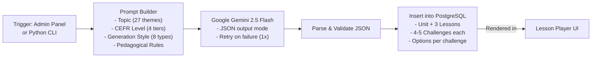

# AI Content Pipeline

> How Faro generates language learning content using AI.

## Overview

Faro's content pipeline uses **Google Gemini 2.5 Flash** to generate complete language curricula on demand. Instead of manually writing lessons and exercises, administrators can generate units, lessons, and challenges with a single click — or via the Python CLI for bulk operations.

## Architecture



## Content Types

### Unit

A thematic grouping of lessons (e.g., "Corporate Strategy & Hostile Takeovers").

### Lesson

3 lessons per unit, each focusing on a subtopic.

### Challenges

4-5 challenges per lesson, from these types:

| Type          | Description                         | Example                                 |
| ------------- | ----------------------------------- | --------------------------------------- |
| **SELECT**    | Multiple choice with context        | "Which word fits the scenario?"         |
| **INSERT**    | Cloze deletion (fill in blank)      | "The \_\_\_ is on the table."           |
| **MATCH**     | Pair target words with translations | 8 options, 4 pairs                      |
| **DICTATION** | Listen and type the exact sentence  | Hidden from user, revealed for checking |

## Pedagogical Methodology

Faro uses a **Hybrid Sliding Scale** approach:

| CEFR Level                  | Direct Translation | Contextual Inference | Description                        |
| --------------------------- | ------------------ | -------------------- | ---------------------------------- |
| **A1** (Beginner)           | 80%                | 20%                  | Simple vocabulary, basic sentences |
| **A2/B1** (Elementary)      | 50%                | 50%                  | Short scenarios with clues         |
| **B2** (Upper Intermediate) | 20%                | 80%                  | Collocations, natural usage        |
| **C1/C2** (Advanced)        | 0%                 | 100%                 | Tone, irony, idioms, nuance        |

## Available Topics (27)

| #   | Topic                                  | Focus                                  |
| --- | -------------------------------------- | -------------------------------------- |
| 1   | Corporate Strategy & Hostile Takeovers | Business English, negotiation idioms   |
| 2   | Startups & Venture Capital             | Pitching, equity, burn rate            |
| 3   | Office Politics & HR Conflicts         | Diplomacy, conflict resolution         |
| 4   | Global Supply Chain Logistics          | Process descriptions, causality        |
| 5   | Personal Finance & Taxation            | Credit scores, banking jargon          |
| 6   | Criminal Law & Courtroom Drama         | Legal jargon, objection types          |
| 7   | International Diplomacy & Geopolitics  | Soft power, sanctions, treaties        |
| 8   | Social Inequality & Activism           | Sociological terms, protest vocabulary |
| 9   | Climate Change & Green Tech            | Carbon footprint, sustainability       |
| 10  | AI Ethics                              | Speculation, bias, algorithms          |
| 11  | Neuroscience & The Human Mind          | Cognitive functions, metaphors         |
| 12  | Space Exploration & Colonization       | Physics concepts, conditionals         |
| 13  | Cybersecurity & Hacking                | Digital threats, encryption            |
| 14  | Real Estate & Home Renovation          | Mortgages, construction terms          |
| 15  | Advanced Culinary Arts                 | Cooking techniques, flavor profiles    |
| 16  | Travel: Airport Nightmare              | Customs, delays, compensation          |
| 17  | Automotive Trouble & Traffic           | Car parts, insurance claims            |
| 18  | Health: Symptoms & Hospitalization     | Medical procedures                     |
| 19  | Romance: Breakups & Divorce            | Emotional nuance, regret               |
| 20  | Grief, Loss & Nostalgia                | Subtle emotions, memories              |
| 21  | Betrayal & Deception                   | Lying nuances, accusation              |
| 22  | Art History & Criticism                | Descriptive adjectives, eras           |
| 23  | Literature & Storytelling              | Narrative tenses, archetypes           |
| 24  | Sports Dynamics & Fandom               | Sports idioms, competition             |
| 25  | Mass Media & Misinformation            | Bias, sensationalism                   |
| 26  | Philosophy & Existentialism            | Abstract reasoning                     |
| 27  | Urban Slang & Street Talk              | Colloquialisms, phrasal verbs          |

## Generation Styles

AI content can be generated in any of these styles:

- Humorous
- Academic
- Dramatic
- Casual
- Urgent
- Poetic
- Sarcastic
- Mystery

## How to Generate Content

### Via Admin Panel (Recommended)

1. Navigate to `/admin` (requires admin access)
2. Go to Courses → Select a course
3. Click **"Generate Content with AI"**
4. Select:
   - Theme (1-27)
   - CEFR Level
   - Generation Style (optional, random by default)
5. Click Generate → Content appears in the database immediately

### Via Python CLI (Bulk)

```bash
cd scripts
python content_pipeline.py
```

Follow the interactive prompts to:

1. Select target language
2. Select or create a course
3. Choose a theme
4. Choose a CEFR level

The script generates one unit with 3 lessons and inserts it directly into the database.

## AI Key Management

Faro supports multiple Gemini API keys for redundancy:

```bash
# In .env
GEMINI_API_KEY_1="your-first-key"
GEMINI_API_KEY_2="your-second-key"
GEMINI_API_KEY_3="your-third-key"
GEMINI_API_KEY_4="your-fourth-key"
GEMINI_API_KEY="fallback-key"
```

The system:

1. Collects all `GEMINI_API_KEY_*` environment variables
2. Adds `GEMINI_API_KEY` as a final fallback
3. Shuffles keys randomly for load distribution
4. Tries each key with a 60-second timeout
5. Falls through to the next key on failure

## Content Safety

All AI-generated content passes through:

1. **JSON validation** — Ensures the response is valid and complete
2. **DOMPurify sanitization** — Strips XSS vectors from HTML/text
3. **Database constraints** — Drizzle ORM ensures type safety
4. **Manual review** (optional) — Admin can review and edit before publishing

## Limitations

- Gemini 2.5 Flash has a rate limit of 60 requests per minute on the free tier
- Complex prompts (C1/C2 level) may occasionally need regeneration
- Generated content should be reviewed for factual accuracy, especially for niche topics
