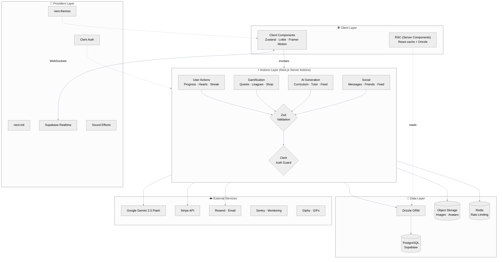
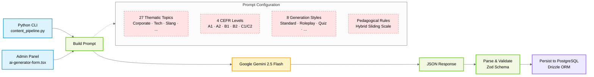
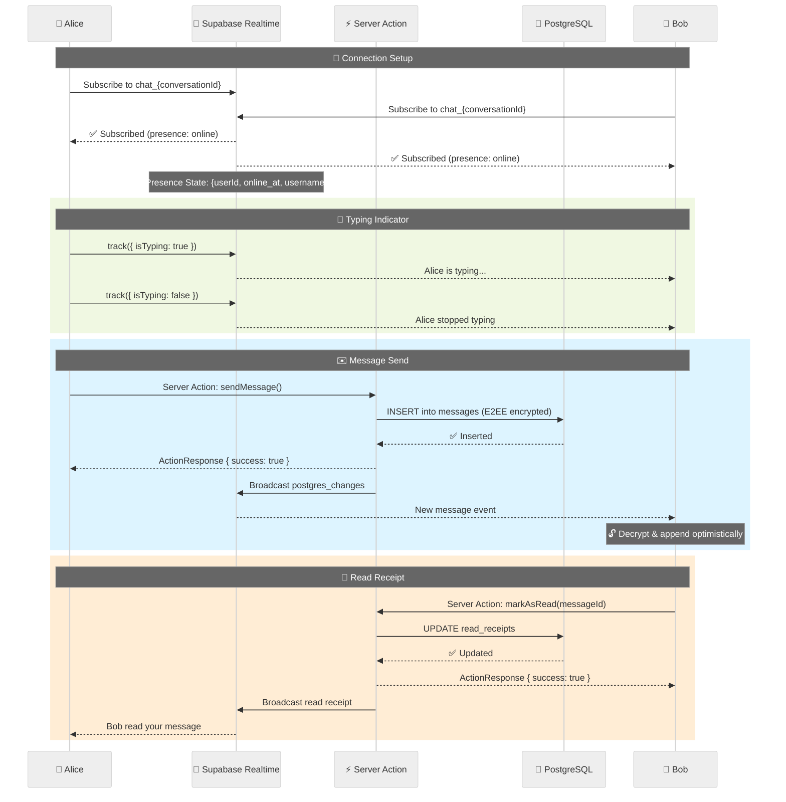

# Faro Architecture

> A comprehensive overview of Faro's system architecture, data flow, and engineering decisions.
>
> **Applies to version 0.2.0+** — Last updated: 2026-07-03

---

## Table of Contents

1. [Topology Overview](#1-topology-overview)
2. [Data Layer](#2-data-layer)
3. [AI & Content Pipeline](#3-ai--content-pipeline)
4. [Real-Time Communication](#4-real-time-communication)
5. [Security & Anti-Cheat](#5-security--anti-cheat)
6. [Native Integration](#6-native-integration)
7. [Key Design Decisions](#7-key-design-decisions)

---

## 1. Topology Overview

Faro follows a **Server-Centric** architecture. All data mutations happen on the server through Next.js Server Actions, never on the client. The client is a thin UI layer that communicates exclusively through typed Server Actions and React Server Components.

### Layer Diagram



### Request Flow

```
User → Browser/Tauri/Capacitor
  → Clerk Auth (middleware.ts)
    → RSC loads data (React.cache + Drizzle)
      → Client Component renders UI
        → User interacts → Server Action fired
          → Clerk auth() verifies userId
            → Zod validates input payload
              → Drizzle ORM executes typed query
                → ActionResponse<T> returned to client
                  → UI updates (router.refresh / setState)
```

---

## 2. Data Layer

### Database

- **PostgreSQL 15** hosted on Supabase (or Neon)
- **Drizzle ORM** for all database interactions (no raw SQL in production code)
- **35 tables** covering courses, users, gamification, chat, social, and AI content
- **React.cache()** wrapping for all server-side queries to prevent redundant fetches

### Key Schema Highlights

```typescript
// All tables use Drizzle's pgTable with full TypeScript inference
export const userProgress = pgTable(
  "user_progress",
  {
    userId: text("user_id").notNull().unique(),
    hearts: integer("hearts").notNull().default(5),
    points: integer("points").notNull().default(0),
    streak: integer("streak").notNull().default(0),
    league: text("league").notNull().default("BRONZE"),
    // ... plus XP, power-ups, E2EE keys, preferences
  },
  (t) => ({
    leagueIdx: index("user_progress_league_idx").on(t.league),
    pointsIdx: index("user_progress_points_idx").on(t.points),
  }),
);
```

### Passive Heart Regeneration

Hearts regenerate using a **lazy UTC check** — no CRON jobs:

```
When user accesses any page:
  1. Calculate hours since lastHeartChange
  2. If >= 5 hours → refill 1 heart
  3. Update lastHeartChange

This avoids background jobs entirely.
```

### PRO Subscription

The `calculateIsPro()` helper in `src/lib/subscription.ts` implements a **24-hour grace period** to prevent Stripe processing delays from interrupting the user experience.

---

## 3. AI & Content Pipeline

### Architecture



### Key Design Decisions

- **No static JSON content** — all curriculum is AI-generated on demand
- **Hybrid Sliding Scale pedagogy** — ratio of direct translation to contextual inference varies by CEFR level
  - A1: 80% direct / 20% context
  - C1-C2: 0% direct / 100% complex context
- **Multiple Gemini API keys** (up to 4) with round-robin rotation and 60s timeout
- **Fallback chain**: key_1 → key_2 → key_3 → key_4 → GEMINI_API_KEY

### Content Types Generated

| Type          | Description                                               |
| ------------- | --------------------------------------------------------- |
| Unit          | Thematic grouping of lessons (e.g., "Corporate Strategy") |
| Lesson        | 3 per unit, each with 4-5 challenges                      |
| Challenge     | SELECT (MCQ), INSERT (cloze), MATCH (pairs), DICTATION    |
| Voice Tutor   | Real-time conversation practice with Gemini Live API      |
| Survival Mode | Roleplay NPC conversations with adaptive difficulty       |

---

## 4. Real-Time Communication

### Supabase Realtime Channels

| Channel                   | Purpose                   | Events                                           |
| ------------------------- | ------------------------- | ------------------------------------------------ |
| `chat_{conversationId}`   | Live message updates      | postgres_changes on messages + message_reactions |
| `global_presence`         | Online status tracking    | Presence sync (0 DB writes)                      |
| `channel` (notifications) | Live notification updates | postgres_changes on notifications                |

### Presence Architecture



### E2EE (End-to-End Encryption)

- **Algorithm**: AES-GCM with 256-bit keys
- **Key exchange**: WebCrypto `subtle.generateKey()` / `subtle.exportKey()`
- **Storage**: Public keys in `user_progress.e2e_public_key`, encrypted room keys in `conversationKeys`
- **Legacy**: Signal Protocol fields remain in schema but are deprecated

---

## 5. Security & Anti-Cheat

### Defense Layers

| Layer                | Technology                  | What It Protects                             |
| -------------------- | --------------------------- | -------------------------------------------- |
| Authentication       | Clerk middleware            | All non-public routes                        |
| Admin Vault          | HMAC-signed cookie          | `/admin` panel access                        |
| Input Validation     | Zod schemas                 | Every Server Action payload                  |
| Rate Limiting        | Upstash Redis               | Login attempts, AI generation, heart actions |
| XSS Prevention       | DOMPurify (server-side)     | AI-generated content, user input             |
| CSP Headers          | next.config.mjs             | Iframe/XSS/connect-src restrictions          |
| SQL Injection        | Drizzle ORM (parameterized) | All database queries                         |
| Anti-Spoofing        | Drizzle boundaries          | Challenge ID verification, XP validation     |
| RLS                  | Supabase + Clerk JWT        | Row-level database security                  |
| Webhook Verification | Stripe signature            | Payment event authenticity                   |

### Anti-Cheat Rules

```
1. All XP mutations happen server-side (no client-side XP manipulation)
2. Each challenge progress is verified against the actual lesson
3. Power-up consumption is validated against user's inventory
4. Rate limits prevent automated exploitation
5. Generic error messages never expose internals
```

---

## 6. Native Integration

### Desktop (Tauri v2)

```
┌─────────────────────────────────────┐
│      WebView2 (Next.js App)          │
├─────────────────────────────────────┤
│      Tauri Bridge (Rust)             │
│  ┌──────────┐ ┌──────────────────┐  │
│  │ Plugins  │ │ Commands         │  │
│  │ - deep-  │ │ - Uninstaller    │  │
│  │   link   │ │   injection      │  │
│  │ - opener │ │ - Window mgmt    │  │
│  │ - process│ │ - Deep link      │  │
│  │ - updater│ │   routing        │  │
│  │ - single │ └──────────────────┘  │
│  │   inst.  │                       │
│  │ - log    │                       │
│  └──────────┘                       │
├─────────────────────────────────────┤
│      Operating System                │
│  Win32 / macOS / Linux              │
└─────────────────────────────────────┘
```

**Key capabilities** (defined in `src-tauri/capabilities/`):

- `core:default` — Core Tauri operations
- `opener:allow-open-url` — Open external URLs
- `deep-link:default` — Custom scheme `myduolingo://`
- `updater:default` — Auto-updates via GitHub Releases
- `process:allow-restart` — App restart capability

### Mobile (Capacitor v8 Android)

- Deep links via `App.addListener("appUrlOpen")`
- Hardware back button interception
- Native language detection via `navigator.language`
- OneSignal push notifications

---

## 7. Key Design Decisions

| Decision                           | Rationale                                                             |
| ---------------------------------- | --------------------------------------------------------------------- |
| **Server Actions over API Routes** | Simpler data flow, same security, no CORS                             |
| **Zustand over Redux**             | Minimal boilerplate, built-in persist middleware, tree-shakeable      |
| **Drizzle over Prisma**            | Lighter, SQL-like syntax, better Postgres feature support             |
| **Python for content pipeline**    | Better for data processing scripts, Gemini SDK for Python more mature |
| **window.location.href for OAuth** | Forces Clerk to re-initialize from cookies (SPA routing breaks OAuth) |
| **No CRON for hearts**             | Lazy UTC check eliminates complexity and DB pool pressure             |
| **Multiple Gemini keys**           | API rate limits and redundancy without single point of failure        |
| **Custom NSIS installer**          | Full control over Windows installation UX (privacy, uninstall)        |

---

## Related Documentation

- [FARO_MASTER_BLUEPRINT.md](FARO_MASTER_BLUEPRINT.md) — Complete codebase analysis
- [DESIGN_SYSTEM.md](DESIGN_SYSTEM.md) — UI/UX design tokens and components
- [SETUP.md](SETUP.md) — Local development setup
- [API.md](API.md) — API route documentation
- [CONTRIBUTING.md](CONTRIBUTING.md) — How to contribute
