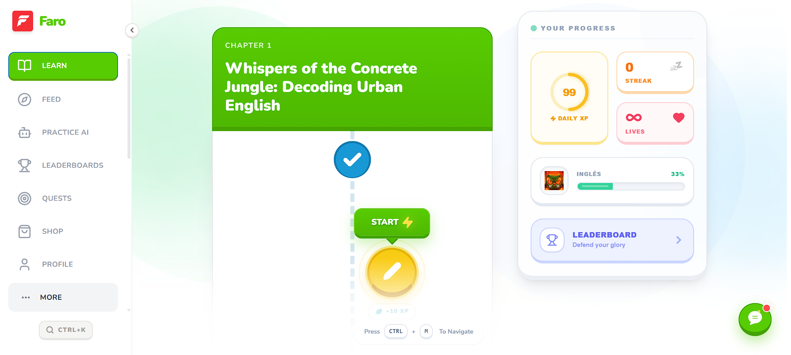
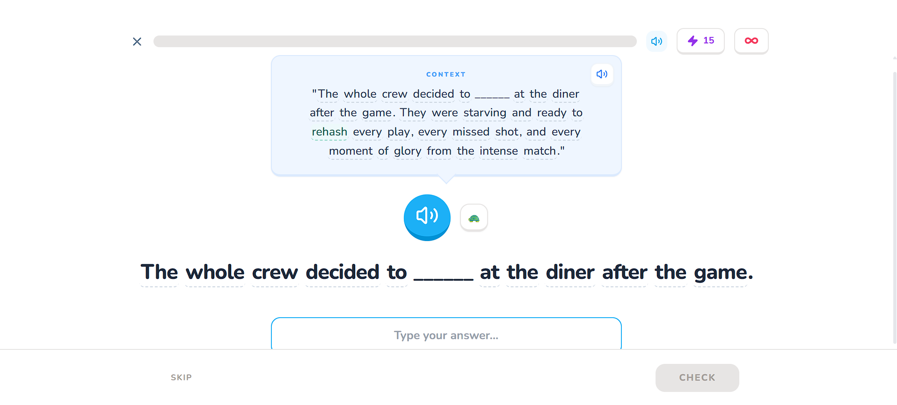
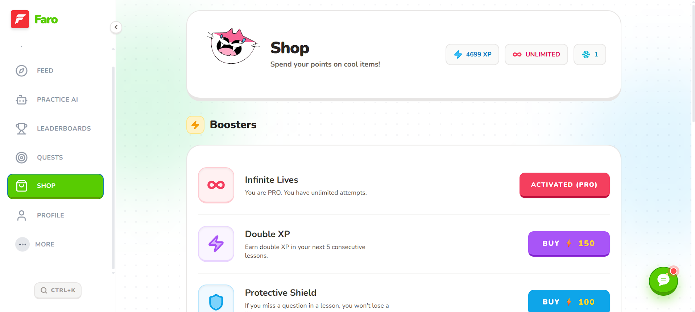
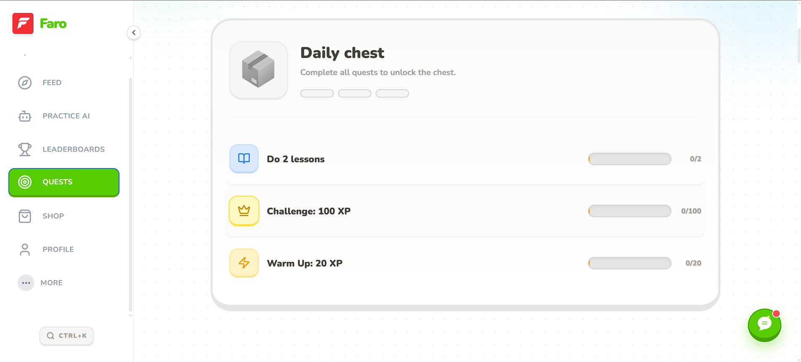
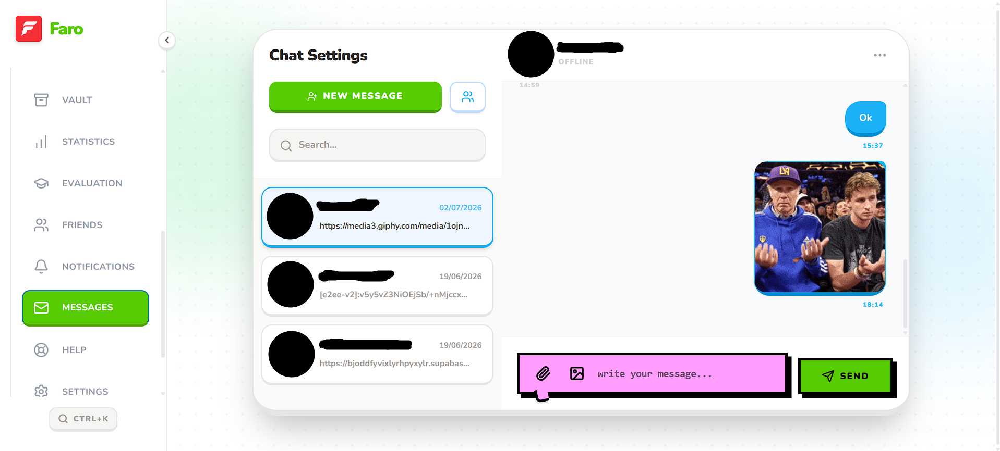
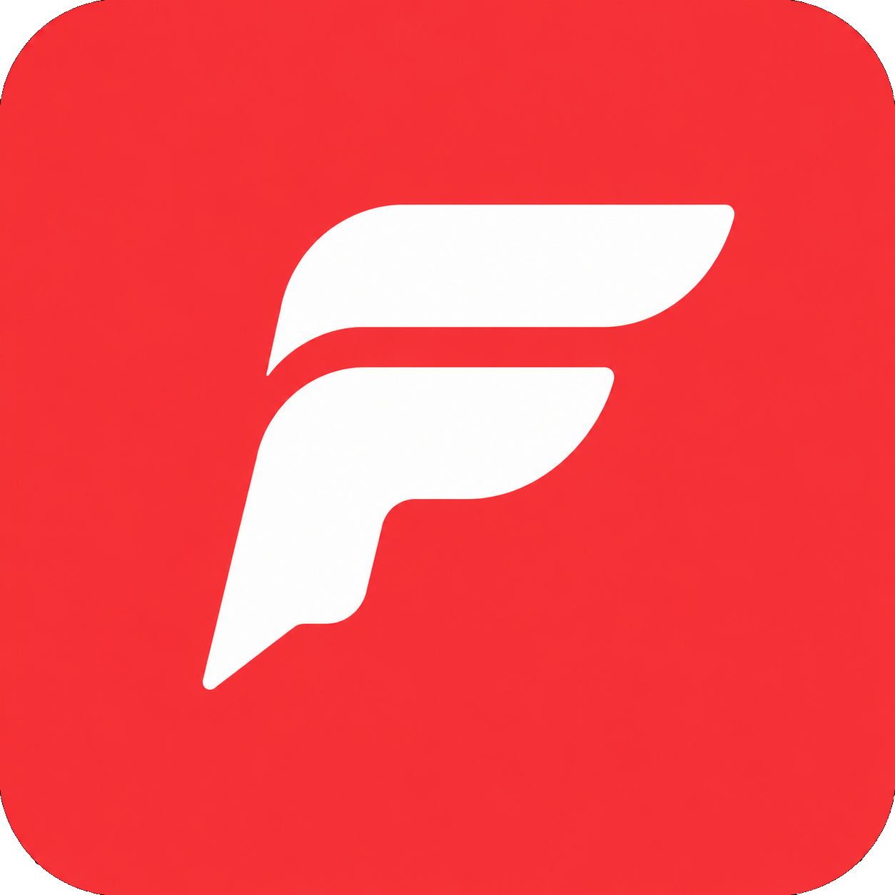

<div align="center">
  <picture>
    <source media="(prefers-color-scheme: dark)" srcset="public/banner_faro.png">
    
  </picture>

  <br />

  <p align="center">
    <strong>Language Learning, Reimagined.</strong>
    <br />
    A gamified, AI-powered micro-learning platform built with Next.js, TypeScript, and a passion for teaching.
  </p>

  <p align="center">
    <a href="https://myduolingo.vercel.app"><strong>Try Faro Live »</strong></a>
    <br />
    <br />
    <a href="#-features">Features</a>
    ·
    <a href="#-quick-start">Quick Start</a>
    ·
    <a href="ARCHITECTURE.md">Architecture</a>
    ·
    <a href="CONTRIBUTING.md">Contributing</a>
    ·
    <a href="#-community">Community</a>
    ·
    <a href="https://github.com/imperador1k/myduolingo/issues">Issues</a>
  </p>

  <!-- Badges -->
  <div align="center">

  <!-- Row 1: Project Status & Social Proof -->

<a href="https://github.com/imperador1k/myduolingo/releases"></a>
<a href="https://github.com/imperador1k/myduolingo/commits/main"></a>
<a href="LICENSE"></a>
<a href="CONTRIBUTING.md"></a>
<a href="https://github.com/imperador1k/myduolingo/stargazers"></a>
<br />

  <!-- Row 2: Core Stack -->

<a href="https://nextjs.org/"></a>
<a href="https://www.typescriptlang.org/"></a>
<a href="https://v2.tauri.app/"></a>
<a href="https://tailwindcss.com/"></a>
<a href="https://orm.drizzle.team"></a>
<a href="https://vitest.dev/"></a>
<a href="https://playwright.dev/"></a>
<br />

  <!-- Row 3: Infrastructure -->

<a href="https://www.postgresql.org/"></a>
<a href="https://supabase.com/"></a>
<a href="https://upstash.com/"></a>
<a href="https://sentry.io/"></a>
<a href="https://vercel.com/"></a>
<a href="https://www.docker.com/"></a>
<br />

  <!-- Row 4: Services & AI -->

<a href="https://clerk.com/"></a>
<a href="https://stripe.com/"></a>
<a href="https://groq.com/"></a>
<a href="https://deepmind.google/gemini/"></a>
<a href="https://elevenlabs.io/"></a>
<a href="https://giphy.com/"></a>
<br />

  <!-- Row 5: Quality & Security -->

<a href="https://github.com/imperador1k/myduolingo/actions"></a>
<a href="https://codecov.io/gh/imperador1k/myduolingo"></a>
<a href="https://github.com/imperador1k/myduolingo/security/code-scanning"></a>
<a href="https://github.com/imperador1k/myduolingo/blob/main/CONTRIBUTING.md"></a>

  </div>
</div>

<br />

---

## 📑 Table of Contents

- [About](#-about)
- [Features](#-features)
- [Screenshots](#-screenshots)
- [Architecture](#-architecture)
- [Quick Start](#-quick-start)
- [Tech Stack](#-tech-stack)
- [Project Structure](#-project-structure)
- [Contributing](#-contributing)
- [Community](#-community)
- [License](#-license)

---

## 📖 About

**Faro** is an open-source language learning platform inspired by the best parts of Duolingo — gamification, micro-lessons, and streaks — while pushing further with AI-powered content generation, real-time social features, desktop and mobile native apps, and full end-to-end encryption for messaging.

Faro is **not** a clone. It stands as an independent project with its own architecture, stack decisions, and pedagogical methodology. The Duolingo inspiration lives only in the tactile, playful UI design and the spaced-repetition learning model — everything else is built from scratch.

### Why "Faro"?

_Faro_ (Portuguese for "lighthouse") symbolizes guidance, illumination, and safe passage — exactly what a language learning companion should provide.

---

## ✨ Features

### 🧠 AI-Powered Content Pipeline

- Generate complete language curricula (units, lessons, challenges) with one click via Google Gemini 2.5 Flash
- 27 thematic topics from Corporate Strategy to Urban Slang
- 4 CEFR levels (A1 through C1/C2) with adaptive difficulty
- Headless CMS admin panel for pedagogical teams

### 🏆 Gamification Engine

- Hearts, XP, Streaks, Leagues (Bronze → Diamond)
- Power-ups: XP Boost, Heart Shield, Streak Freeze
- Daily quests, chest rewards, shop
- Heart Clinic for mistake review
- Anti-cheat with Zod validation + rate limiting

### 💬 Real-Time Social Features

- 1-on-1 and group chat with E2EE (WebCrypto AES-GCM)
- Presence indicators (online/typing) via Supabase Realtime
- GIF picker (Giphy), voice messages, file attachments
- Follow system, friends list, activity feed with high-fives

### 📱 Cross-Platform

- **Web**: PWA-ready Next.js 14 app (deployed on Vercel)
- **Desktop**: Native Tauri v2 app (Windows, macOS, Linux)
- **Mobile**: Capacitor v8 wrapper for Android
- Single codebase, multiple targets

### 🎨 Premium HD Play UI

- Bento-box card design with 3D press mechanics
- Framer Motion animations, Lottie celebrations
- Dark mode, haptic feedback, spatial audio
- Custom cursor, scrollbar, and gamified tour (Driver.js)

### 🔒 Enterprise-Grade Security

- Zod validation on every Server Action
- HMAC-signed admin vault tokens
- DOMPurify server-side XSS sanitization
- CSP headers, rate limiting (Upstash Redis)
- Supabase RLS with Clerk JWT templates
- Stripe webhook signature verification

---

## 📸 Screenshots

<div align="center">
  <table>
    <tr>
      <td align="center" width="33%">
        
        <br />
        <sub><strong>Learning Path</strong> — Unit progression map</sub>
      </td>
      <td align="center" width="33%">
        
        <br />
        <sub><strong>Lesson Player</strong> — Interactive challenges</sub>
      </td>
      <td align="center" width="33%">
        
        <br />
        <sub><strong>Shop</strong> — Power-ups & cosmetics</sub>
      </td>
    </tr>
    <tr>
      <td align="center" width="33%">
        
        <br />
        <sub><strong>Quests</strong> — Daily challenges & rewards</sub>
      </td>
      <td align="center" width="33%">
        
        <br />
        <sub><strong>E2EE Chat</strong> — Encrypted conversations</sub>
      </td>
      <td align="center" width="33%">
        
        <br />
        <sub><strong>Faro</strong> — Your language lighthouse</sub>
      </td>
    </tr>
  </table>
</div>

---

## 🏗️ Architecture

```
┌─────────────────────────────────────────────────┐
│                  UI LAYER                        │
│  RSC (Server) │ Client Components │ Zustand     │
├─────────────────────────────────────────────────┤
│               ACTIONS LAYER                      │
│  Server Actions │ Zod │ Clerk Auth │ Drizzle     │
├─────────────────────────────────────────────────┤
│              PROVIDERS LAYER                     │
│  Clerk → Theme → i18n → Toaster → Presence      │
├─────────────────────────────────────────────────┤
│                 DATA LAYER                       │
│  PostgreSQL (Supabase) │ Drizzle ORM │ Redis    │
└─────────────────────────────────────────────────┘
```

See [ARCHITECTURE.md](ARCHITECTURE.md) for the full deep dive.

---

## 🚀 Quick Start

### Prerequisites

- **Node.js** >= 18.0.0
- **PostgreSQL** 15+ (or Docker for local)
- A [Clerk](https://clerk.com/) account for authentication
- A [Google Gemini](https://aistudio.google.com/) API key for AI features

### 1. Clone & Install

```bash
git clone https://github.com/imperador1k/myduolingo.git
cd myduolingo
npm install
```

### 2. Environment Variables

```bash
cp .env.example .env
```

Then edit `.env` with your keys. See [SETUP.md](SETUP.md) for a detailed walkthrough.

### 3. Database & Redis Setup

**Option A: Docker (recommended)**

Starts PostgreSQL 15 and Redis 7 with one command:

```bash
docker compose up -d
```

Then run migrations and seed test data:

```bash
docker compose run --rm setup
```

**Option B: Own PostgreSQL instance**

Set `DATABASE_URL` in `.env` and push the schema:

```bash
npx drizzle-kit push
```

### 4. Start Developing

```bash
npm run dev
```

Open [http://localhost:3000](http://localhost:3000) and you're in.

> **New to Faro?** See [SETUP.md](SETUP.md) for the complete walkthrough with all required accounts.

---

## 📦 Tech Stack

| Category          | Technology                                 |
| ----------------- | ------------------------------------------ |
| **Framework**     | Next.js 14 (App Router)                    |
| **Language**      | TypeScript, Rust (Tauri), Python (scripts) |
| **Styling**       | Tailwind CSS, Framer Motion, Lottie        |
| **Database**      | PostgreSQL 15, Drizzle ORM                 |
| **Auth**          | Clerk (with Supabase JWT template)         |
| **AI**            | Google Gemini 2.5 Flash                    |
| **Real-time**     | Supabase Realtime (WebSockets)             |
| **Payments**      | Stripe                                     |
| **Desktop**       | Tauri v2 (Rust)                            |
| **Mobile**        | Capacitor v8                               |
| **State**         | Zustand (persisted)                        |
| **Testing**       | Vitest + Playwright                        |
| **Monitoring**    | Sentry                                     |
| **Rate Limiting** | Upstash Redis                              |
| **i18n**          | next-intl                                  |

---

## 🗺️ Project Structure

```
src/
├── app/              # Next.js App Router (131 pages, 8 API routes)
├── actions/          # 34 Server Actions (all mutations)
├── components/       # 137 React components (15 categories)
├── lib/              # 24 utility modules
├── db/               # Schema (35 tables) + Drizzle queries
├── types/            # Shared TypeScript types
├── hooks/            # 8 custom React hooks
├── store/            # 8 Zustand stores
├── middleware.ts     # Clerk auth + admin vault
└── __tests__/        # Vitest tests

src-tauri/            # Desktop native layer (Rust)
scripts/              # Python content pipeline + TS utilities
messages/             # i18n JSON files
installer-app/        # Custom NSIS installer UI
```

---

## 🤝 Contributing

We welcome contributions from everyone! Whether you're fixing a bug, adding a feature, translating, or writing docs — you're awesome.

Please read [CONTRIBUTING.md](CONTRIBUTING.md) and our [Code of Conduct](CODE_OF_CONDUCT.md) before getting started.

### Quick Links

- [Setup Guide](SETUP.md) — Get your dev environment running
- [Testing Guide](TESTING.md) — How we test
- [Style Guide](STYLE_GUIDE.md) — Code conventions
- [API Docs](API.md) — API route reference
- [Architecture](ARCHITECTURE.md) — System design deep dive

---

## 💬 Community

Join the Faro community — ask questions, share ideas, show what you've built, or help others.

| Platform | Purpose | Link |
| -------- | ------- | ---- |
| 💬 **GitHub Discussions** | Questions, ideas, show & tell | [Join](https://github.com/imperador1k/myduolingo/discussions) |
| 🐛 **GitHub Issues** | Bug reports & feature requests | [Open](https://github.com/imperador1k/myduolingo/issues) |
| ⭐ **GitHub Stars** | Show your support | [Star](https://github.com/imperador1k/myduolingo/stargazers) |
| 🍴 **Forks** | Build your own version | [Fork](https://github.com/imperador1k/myduolingo/fork) |

### 🌟 Contributors

<a href="https://github.com/imperador1k/myduolingo/graphs/contributors">
  
</a>

---

## 📄 License

This project is [MIT](LICENSE) licensed. Copyright (c) 2026 Miguel Pereira Santos.

---

## 🙏 Acknowledgements

- **Duolingo** — For revolutionizing language learning UX and inspiring our design philosophy
- **Next.js team** — For the incredible framework
- **Google Gemini** — For making AI accessible
- **Clerk** — For seamless authentication
- **Supabase** — For the amazing open-source backend
- All our contributors and the open-source community

---

<div align="center">
  <sub>Built with ❤️ and ☕ by Miguel Pereira Santos</sub>
  <br />
  <sub>Faro — A Lighthouse for Language Learners</sub>
</div>
